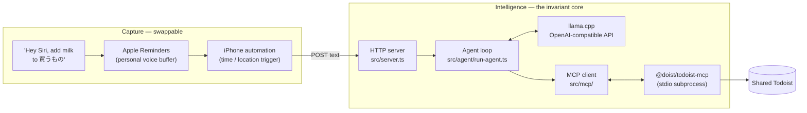

# todoist-agent

Voice-first task capture into a Todoist shared with my wife, driven by a local LLM.

I think of things to buy while standing in the kitchen with my hands full. Opening an app,
finding the right project and typing the item is enough friction that the thought is gone by
the time I get there. This agent removes that: I say the thing out loud, and it lands in the
right project of the Todoist my wife and I share.

The LLM runs locally on [llama.cpp](https://github.com/ggml-org/llama.cpp), so the raw
speech never leaves the house — only the resulting task goes to Todoist, which is where it
was headed anyway. Todoist itself is reached through the
[Model Context Protocol](https://modelcontextprotocol.io), via Doist's official
[`@doist/todoist-mcp`](https://github.com/Doist/todoist-mcp) server.

## Design

The system splits in two, and the split is the point.

**Capture** is how words get in. It is deliberately swappable: Siri today, a Whisper box or a
chat client tomorrow. Anything that can POST a line of text qualifies.

**Intelligence** is the core, and it does not change when capture does: an agent loop, a tool
layer over MCP, and one shared Todoist that is the single source of truth. Household tasks
have to live somewhere both of us can see, so a design that ends in a personal reminder or a
private list is a design that has already failed.



Siri's own reminder intent is the capture path because it is the only one that survives being
said in a single breath. Saying "Todoist" out loud is awkward in Japanese, and any flow that
asks a follow-up question turns one thought into a two-step errand — by which point I have
put the milk down and forgotten. So the words go into Reminders under a natural list name,
and an iPhone automation drains that buffer into the agent on a time or location trigger.
Shopping is not time-critical, which is what makes a buffer acceptable here.

## Status

Working:

- The agent loop, with tool calling against Todoist through MCP (`src/agent/`, `src/mcp/`).
- A one-shot CLI (`src/index.ts`).
- A long-running HTTP server with shared-token auth (`src/server.ts`), holding the MCP
  connection open so requests do not pay a cold start.
- Retries around llama.cpp's cold start, so an unattended automation run does not fail
  silently while the model loads.

Not built yet:

- The iOS side — the Reminders list, the automation that drains it, and clearing it
  afterwards. That is Shortcuts configuration rather than code in this repo.
- Realtime sync via Todoist webhooks. The buffer is fine for shopping, so this can wait.
- An interactive REPL and persisted chat history.

## Requirements

- Node.js 20+
- A running llama.cpp server with an OpenAI-compatible endpoint and a tool-calling model
- A Todoist API token — Todoist → Settings → Integrations → Developer

## Setup

```sh
npm install
cp .env.example .env   # then fill in TODOIST_API_KEY
```

`@doist/todoist-mcp` needs no install: the MCP client starts it on demand with `npx`.

## Configuration

Read from `.env` (see [src/config.ts](src/config.ts) and [src/server.ts](src/server.ts)).

| Variable | Required | Default | Purpose |
|---|---|---|---|
| `TODOIST_API_KEY` | yes | — | Todoist API token, passed to the MCP server |
| `LLAMA_BASE_URL` | no | `http://127.0.0.1:8080/v1` | llama.cpp's OpenAI-compatible endpoint |
| `LLAMA_API_KEY` | no | `local` | Ignored by llama.cpp; the OpenAI SDK insists on one |
| `LLAMA_MODEL` | no | `local-model` | Model name sent in the request |
| `AGENT_TOKEN` | no | — | Shared token for the HTTP server. Unset means **no auth** |
| `PORT` | no | `8787` | Port the HTTP server listens on |

`AGENT_TOKEN` is optional so the server can run unauthenticated on a trusted LAN, and it
warns at startup when it does. Set it before the server is reachable from anywhere else.

## Usage

One-shot, from the CLI:

```sh
npm start -- "買い物プロジェクトに牛乳を買うを追加して"
# "add buy milk to the shopping project"
```

As a server, which is what the iPhone automation talks to:

```sh
npm run serve
```

It answers `POST` on any path, taking either JSON or a raw body:

```sh
curl -X POST http://localhost:8787/ \
  -H 'content-type: application/json' \
  -H "x-auth-token: $AGENT_TOKEN" \
  -d '{"text": "買い物プロジェクトに牛乳を買うを追加して"}'
# {"reply":"Added 牛乳を買う to 買い物."}
```

The token also goes through as `Authorization: Bearer <token>` if that suits the client
better.

## Tools

The agent exposes five tools to the LLM ([src/agent/tools.ts](src/agent/tools.ts)). The
underscore-to-hyphen rename is mechanical and lives in one place,
[`TOOL_NAME_MAP`](src/mcp/todoist.ts) — the LLM never sees MCP's naming.

| LLM tool | MCP tool | Purpose |
|---|---|---|
| `find_projects` | `find-projects` | Look a project up by name |
| `add_tasks` | `add-tasks` | Create tasks |
| `find_tasks` | `find-tasks` | Search tasks; `projectId: "inbox"` lists the Inbox |
| `update_tasks` | `update-tasks` | Update tasks; setting `projectId` sorts one into a project |
| `complete_tasks` | `complete-tasks` | Close tasks out |

Names have to be resolved before they can be used, so adding to a project is always
`find_projects` then `add_tasks`. Inbox triage is the same shape: `find_tasks` on the Inbox,
`find_projects` for the destination, `update_tasks` to move it.

## Layout

```
src/
  index.ts           CLI entry: load config, connect, run once, close
  server.ts          HTTP server for iOS Shortcuts, with shared-token auth
  config.ts          .env parsing and llama.cpp defaults
  agent/
    run-agent.ts     the agent loop, and llama.cpp cold-start retries
    tools.ts         tool schemas exposed to the LLM
  llm/
    client.ts        OpenAI-compatible client for llama.cpp
  mcp/
    client.ts        stdio connection to @doist/todoist-mcp
    todoist.ts       LLM <-> MCP name translation and calls
  examples/
    fixed-task.ts    MCP smoke test, no LLM in the loop
```

Further notes: [docs/architecture.md](docs/architecture.md) on the module split,
[docs/agent.md](docs/agent.md) on the prompt and tools.

Type checking is `npm run typecheck`.

## License

ISC
